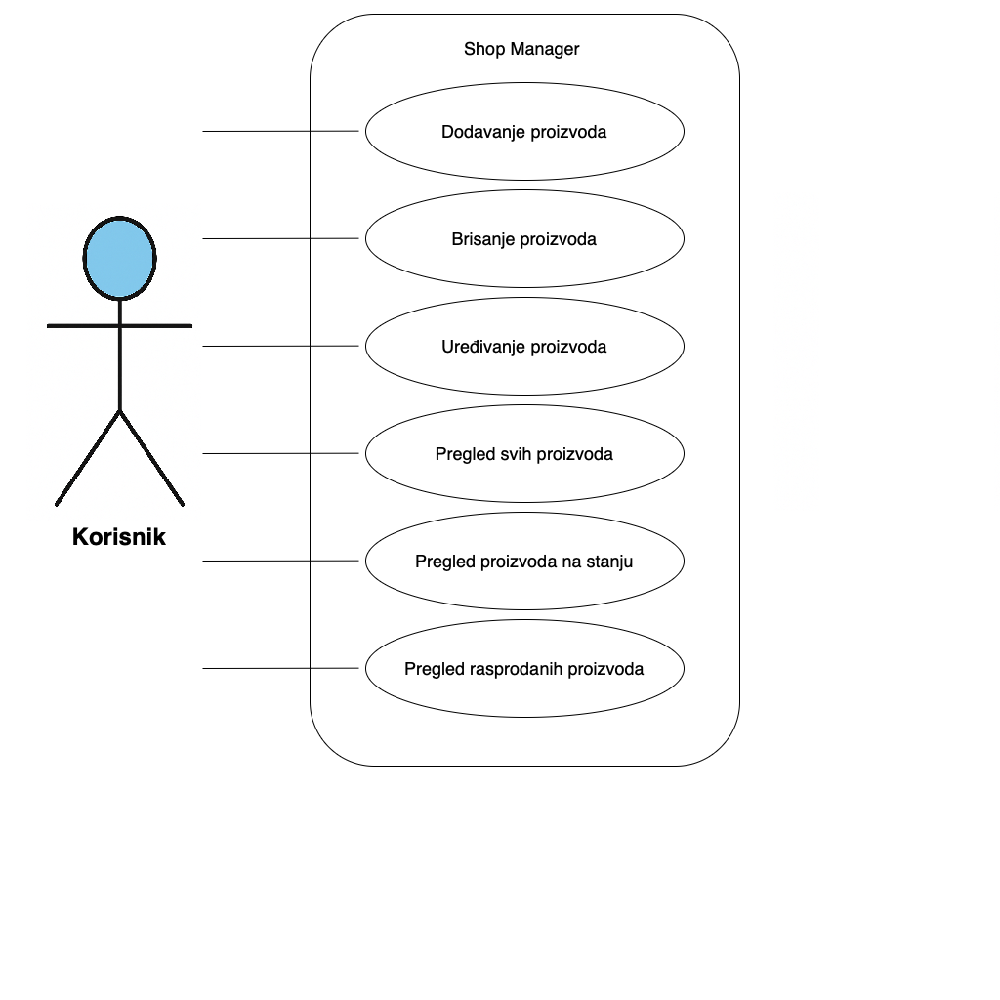

# Shop Manager

## **Management artikala u trgovini**

Projekt izrađen kao dio kolegija Informacijski sustavi na FIPU.

Projekt se fokusira na potrebu određenog poslovnog subjekta, u ovom slučaju trgovine, za vođenjem zaliha i prodaje.

## Opis

Shop Manager je web aplikacija za upravljanje artiklima u trgovini koja omogućuje osnovne CRUD operacije – dodavanje, pregled, ažuriranje i brisanje proizvoda.

Aplikacija podržava i upload slike za svaki proizvod, što omogućuje vizualni prikaz artikala.

Backend je izrađen u Pythonu pomoću Flask okvira, dok se za bazu podataka koristi SQLite zajedno sa SQLAlchemy ORM-om.
Frontend koristi HTML, CSS i Bootstrap kako bi se osigurao moderan i responzivan dizajn.

## UseCase dijagram



## Kako pokrenuti aplikaciju

### Pomoću Docker-a

1. **Instalirajte Docker** – osigurajte da imate instaliran Docker na svom računalu.

2. **Klonirajte repozitorij**:

```bash
git clone https://github.com/danielkatic1986/shop_manager.git
cd shop_manager
```

3. **Pokrenite Docker Compose**:

```bash
docker-compose up --build
```

4. **Otvorite preglednik:**

Aplikacija će biti dostupna na http://localhost:5001.

### Tehnologije

- **Backend**: Python, Flask, SQLAlchemy, SQLite
- **Frontend**: HTML, CSS, Bootstrap
- **Upload slika**: WerkZeug (dio Flask paketa)
- **Docker**: Dockerfile, Docker Compose

### Autor

**Daniel Katić**, 0303123347, FIPU 2024/2025

### Licenca

Ovaj projekt je otvorenog koda – licenca se može definirati prema vašim potrebama.
